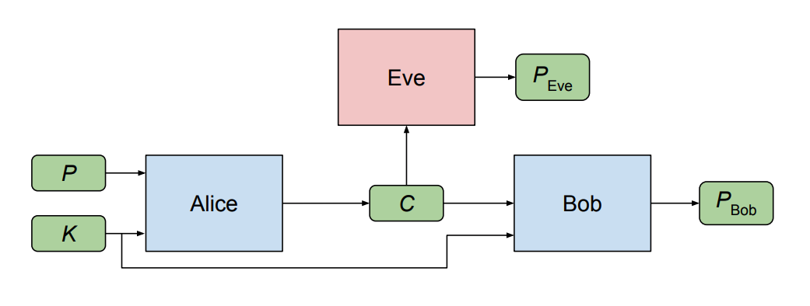
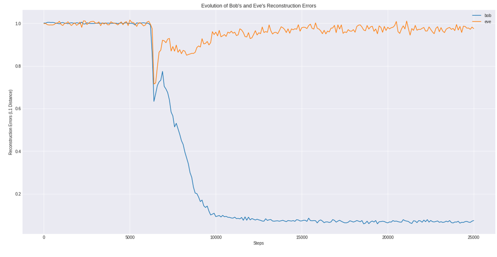
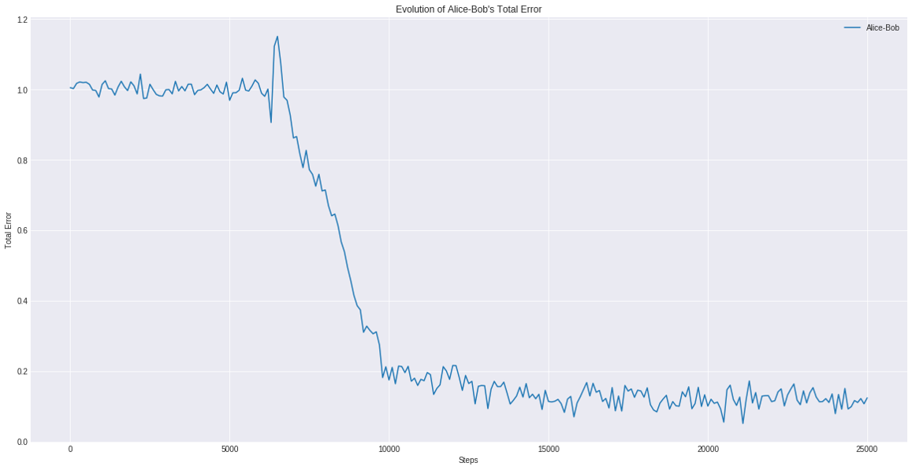

# GAN Cryptosystem

## Overview
PyTorch implementation of [Learning To Protect Communications With Generative Adversarial Neural Networks 1](https://arxiv.org/pdf/1610.06918.pdf).

<figure>

<figcaption> Figure 3: Overview of Cryptosystem </figcaption>
</figure>

## Dependencies
* python 3
* PyTorch 0.4.0

## Results
<figure>

<figcaption> Figure 1: Evolution Of Bob And Eve Reconstruction Errors</figcaption>
</figure>

<figure>

<figcaption> Figure 2: Alice Bob Total Error </figcaption>
</figure>

## Files in this repo
* Main Interface to the program contains Model Training and Inference: [main.py](code/src/main.py)
* Definition of Mix and Transform Architecture: [models.py](code/src/models.py)
* Paths, Plaintext/Key Generation, Encoding/Decoding between UTF-8 and Binary: [utils.py](code/src/utils.py)
* Plots of training results: [plots.ipynb](code/src/plots.ipynb)

## How to run
`python3 src/main.py -h` get a list of all command line arguments

`python3 src/main.py` train model with default command line arguments

`python3 src/main.py --run_type inference` run model inference

## References
1) Martin Abadi, David G. Andersen. [Learning To Protect Communications With Generative Adversarial Neural Networks](https://arxiv.org/pdf/1610.06918.pdf). arXiv:1610.06918, October 2016.
